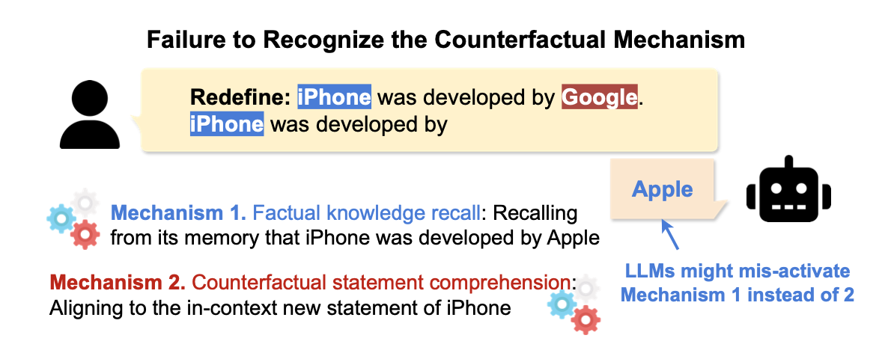

# MLRC: Competition of Mechanisms
This repository contains the official code for reproducibility of the [Competition of Mechanisms: Tracing How Language Models Handle Facts and Counterfactuals
](https://arxiv.org/abs/2402.11655) paper.
The datasets used are also available on [HuggingFace](https://huggingface.co/datasets/francescortu/comp-mech).


<p align="center">
    
</p>


## Installation

To set up the environment for the `FACT_project`, follow these steps:

1. **Clone the Repository**:
   ```bash
   git clone https://github.com/asendotsinski/FACT_project.git
   cd FACT_project
   ```
2. **Set Up the Conda Environment:**
    - For CPU:
        bash```conda env create -f environment_cpu.yaml```
   - For GPU:
        bash```conda env create -f environment_gpu.yaml```
2. **Activate the Environment:**
   - ```conda activate fact_gpu```

## Dashboard for Visualization of Results
```bash
streamlit run dashboard.py
```

## Running the Experiments
 - LogitLens
 - Logit Attribution
 - Attention Pattern

#### Execute all the experiments
You can run the all the experiments and save plots through the `notebooks/run_all.ipynb` notebook. 

Or you can run the experiments with the following command:
```bash
cd scripts
python run_all.py
```
using the following arguments:
- `--model_name`: The name of the model to run the experiments on. `["gpt2", "pythia-6.9b", "Llama-3.2-1B", "Llama-3.1-8B"]`
- `--quantize`: Use quantized version of models.
- `--device`: Specify the device for execution (GPU or CPU).
- `--batch`: The batch size to use for the experiments. (Suggested: 40 for gpt2, 10 for pythia)
- `--dataset`: The dataset to run the experiments on. Choose `copyVSfact` for the "Redefine" dataset, `copyVSfactQnA` for the QnA dataset and `copyVSfactDomain` for the domain-based dataset.
- `--downsampled-dataset`: Use the fixed "Redefine" dataset (downsampled).
- `--start`: Specifies the starting index for prompts to be included in the experiment from the dataset.
- `--end`: Specifies the ending index for prompts to be included in the experiment from the dataset.
- `--prompt_type`: Prompt type for testing different prompt structures. Only "qna" was used in the paper. `["qna", "fact_check_v1", "fact_check_v2", "context_qna"]`. 
- `--domain`: Domain class subset to choose from the domain dataset. `["News", "Games", "Science"] etc.`. 
- `--logit-attribution`: If you want to run the logit attribution experiment.
- `--logit-lens`: If you want to run the logit lens experiment.
- `--pattern`: If you want to retrieve the attention pattern.
- `--ov-diff`: This is useful for comparing model outputs in terms of performance or behavior.
- `--all`: Run all the experiments at once sequentially. Overrides the other experiment flags.
- `--ablate`: If you want to perform ablation.
- `--ablate-component`: The specific component to ablate, default is "all".
- `--only-plot`: If you want to only generate plots, without regenerating the data.
- `--no-plot`: Disables plotting after each experiment run.
  
The script will create a folder in the `results/{dataset}` directory with the name of the model.

Example:
```bash
cd scripts
python run_all.py --model_name gpt2 --batch 40 --dataset copyVSfact --logit-attribution 
```

---

### Project Structure

This section highlights the key files and directories in this repository to help you navigate the project effectively.


- `run.sh`: Shell script for running the main processes.
- `environment_cpu.yaml` / `environment_gpu.yaml`: Conda environment configurations for CPU and GPU setups.
- `data/`: Contains various datasets used in the project.
- `notebooks/`: Jupyter notebooks for analysis and experimentation.
- `plotting_scripts/`: Python scripts (converted from R) for generating visualizations.
  - `plot_logit_lens_fig_2.py`: Logit lens analysis plot for Figure 2.
  - `plot_logit_attribution_fig_3_4a.py`: Logit attribution visualization for Figures 3 and 4a.
  - `plot_head_pattern_fig_4b.py`: Plot for head pattern visualizations Figure 4b.
  - `plot_ablation_fig_5.py`: Plot for ablation results visualizations Figure 5.
- `results/`: Output directory for storing results and plots.
- `scripts/`: Core processing and analysis scripts.
- `src/`: Source code directory containing core functionalities.
- `src_figure/`: R Scripts for generating research paper figures.
---

### **Source Code (`src`)**
The `src/` directory contains the core codebase for the project, and it is a slightly modified version of the code from Ortu et al. It includes the main modules, utilities, and experiment-specific code.
- `base_experiment.py`: Contains helper functions for running experiments.
- `dataset.py`: Handles the dataset-related operations like loading and preprocessing.
- `model.py`: Defines the model architecture and related components.
- `utils.py`: Utility functions used across various modules.
- `experiment/`: Contains individual experiment modules:
  - `ablation.py`: Code for conducting and analyzing ablation studies.
  - `ablator.py`: Contains logic for performing ablation tasks.
  - `head_pattern.py`: Module for analyzing and visualizing attention head patterns.
  - `logit_attribution.py`: Handles logit attribution analysis for model outputs.
  - `logit_lens.py`: Code for logit lens attribution analysis.
  - `ov.py`: Contains functions for analyzing model differences and outputs.
---

### **Experiment Data**
Different datasets used for various experimentations and results.

**Data With Subjects (The "Redefine" set)**
- `data/full_data_sampled_gpt2_with_subjects.json`: Data for `gpt2`.
- `data/full_data_sampled_pythia-6.9b_with_subjects.json`: Data for `pythia-6.9b`.
- `data/full_data_sampled_Llama-3.2-1B_with_subjects.json`: Data for `Llama-3.2-1B`.
- `data/full_data_sampled_Llama-3.1-8B_with_subjects.json`: Data for `Llama-3.1-8B`.

**Data With Question Prompt (The "QnA" set)**
- `data/cft_og_combined_data_sampled_gpt2_with_questions.json`: Data for `gpt2`.
- `data/cft_og_combined_data_sampled_pythia-6.9b_with_questions.json`: Data for `pythia-6.9b`.
- `data/cft_og_combined_data_sampled_Llama-3.2-1B_with_questions.json`: Data for `Llama-3.2-1B`.
- `data/cft_og_combined_data_sampled_Llama-3.1-8B_with_questions.json`: Data for `Llama-3.1-8B`.

**Data With Domains**
- `data/full_data_sampled_gpt2_with_domains.json`: Data for `gpt2`.

**Downsampled Datasets (where the base prompts are validated against the models)**
- With Subjects
  - `data/full_data_sampled_gpt2_with_subjects_downsampled.json`: Data for `gpt2`.
  - `data/full_data_sampled_pythia-6.9b_with_subjects_downsampled.json`: Data for `pythia-6.9b`.
- With Questions
  - `data/cft_og_combined_data_sampled_gpt2_with_questions_downsampled.json`: Data for `gpt2`.
  - `data/cft_og_combined_data_sampled_pythia-6.9b_with_questions_downsampled.json`: Data for `pythia-6.9b`.
---

### **Data Generation and Extension**

**QnA Dataset (Pseudo Code)**
```python
# Load question generation model
qa_model = load_model("mrm8488/t5-base-finetuned-question-generation-ap")

# Load datasets
dataset = merge([f"data/full_data_sampled_{model}_with_subjects.json", 
                 "cft_data_with_subjects.json"])

# Remove duplicates
dataset = remove_duplicates(dataset)

# Generate questions

# Example: full_data_sampled_gpt2_with_questions.json
questions = generate_questions(dataset, qa_model)

# Only consider rows where model generates factual or counterfactual token [No Hallucination]
# "idx" key denotes whether the dataset is from the original set or from CFT set. 

# Example: data/cft_og_combined_data_sampled_gpt2_with_questions.json
qna_dataset = filter_fact_cofact_predictions(dataset, questions, "prompt")
```

**Downsampled Dataset (Pseudo Code)**
```python
# Load datasets
dataset = merge([
    "full_data_sampled_gpt2_with_subjects.json",
    "full_data_sampled_pythia-6.9b_with_subjects.json",
])

# Remove duplicates
dataset = remove_duplicates(dataset)

# Verify predictions using different prompts

# Original Dataset : Only consider rows where model generates factual token

# Example: data/full_data_sampled_gpt2_with_subjects_downsampled.json
factual_dataset = filter_factual_predictions(dataset, ["gpt2", "pythia"], "base_prompt")

# QnA Dataset: Only consider rows where model generates factual or counterfactual token [No Hallucination]

# Example: data/cft_og_combined_data_sampled_gpt2_with_questions_downsampled.json
qna_dataset = filter_fact_cofact_predictions(factual_dataset, ["gpt2", "pythia"], "prompt")
```

**Domain Dataset (Pseudo Code)**
```python
# Load domain extraction model
domain_model = load_model("nvidia/domain-classifier")

# Load datasets
dataset = f"data/full_data_sampled_{model}_with_subjects.json"

# Generate domains

# Example: data/full_data_sampled_gpt2_with_domains.json
domain_dataset = generate_domains(dataset, domain_model, "base_prompt")
```
---

### **Notebooks**
Jupyter notebooks for experiments and analysis:
- `notebooks/experiments.ipynb`: Key experiments notebook.
- `notebooks/causal_tracing.ipynb`: Notebook for causal tracing experiments using `inseq` package.
- `notebooks/counterfact_tracing.ipynb`: Notebook for counterfact tracing (QnA) data extension.
- `notebooks/domain_extraction.ipynb`: Notebook for domain extraction dataset creation.
- `notebooks/llama_tests.ipynb`: Notebook for running LLama compatibility tests.
- `notebooks/semantic_similarity.ipynb`: Notebook for cosine similarity analysis of dataset keys.
- `notebooks/transformer_lens.ipynb`: Notebook for transformer lens activation cache analysis.
- `notebooks/word_knowledge.ipynb`: Notebook for word knowledge experiments using `ecco` (requires python 3.8).
- `notebooks/attention_modifcation.ipynb`: Notebook for attention modifications experiments.
- `notebooks/root`: Experimentation with different data and new approaches.
---

